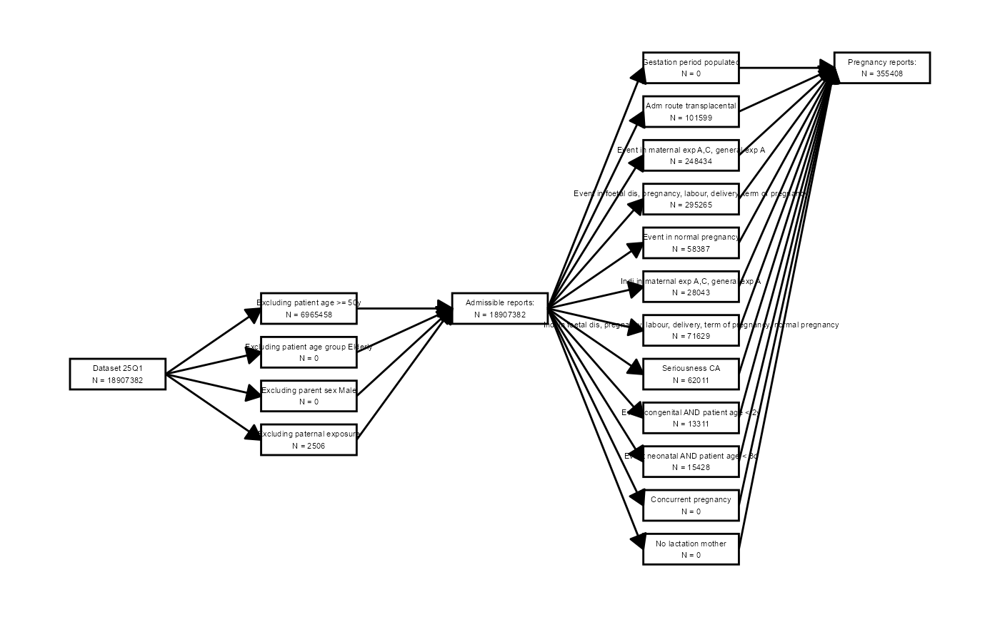
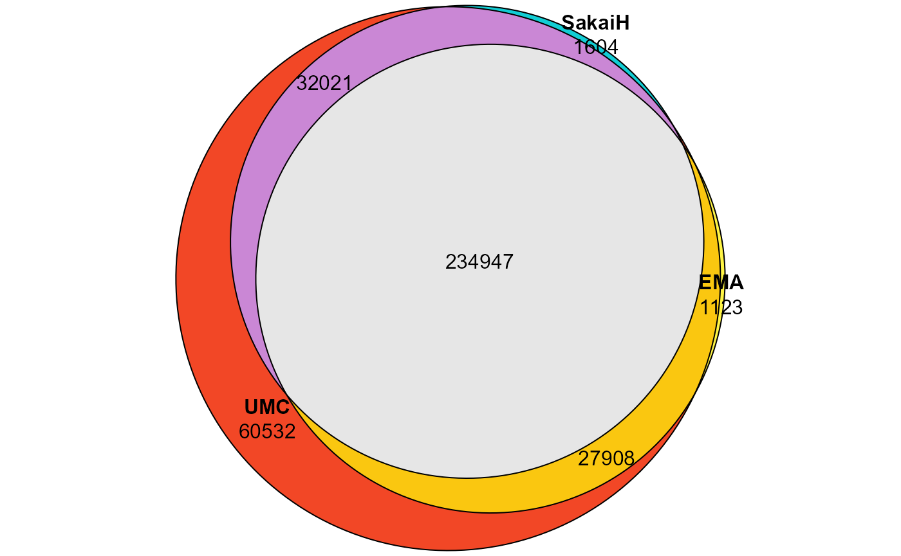
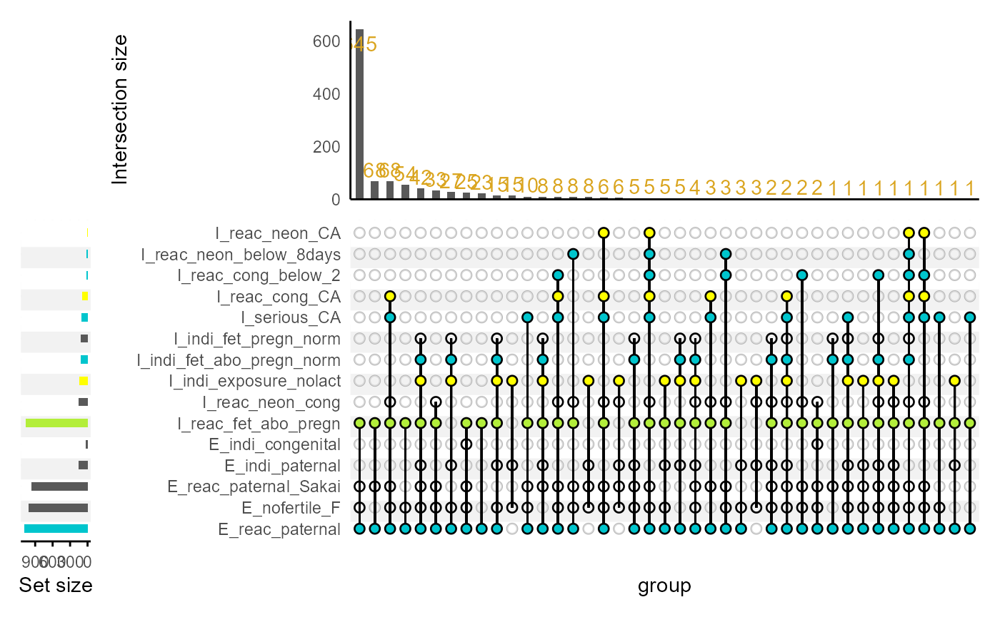
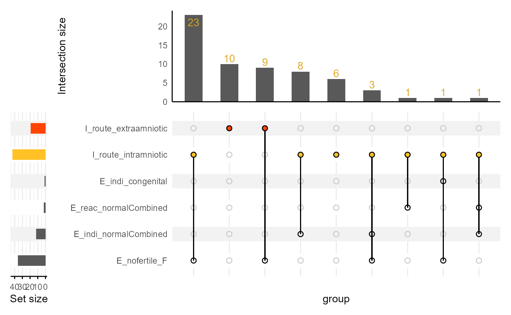
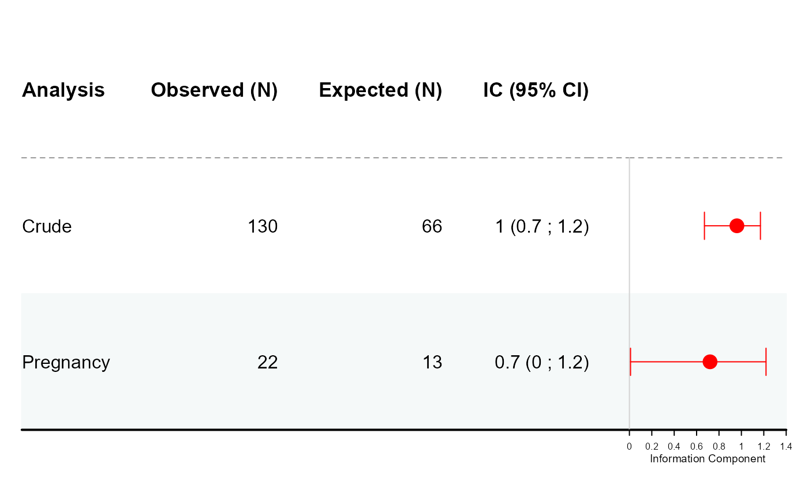
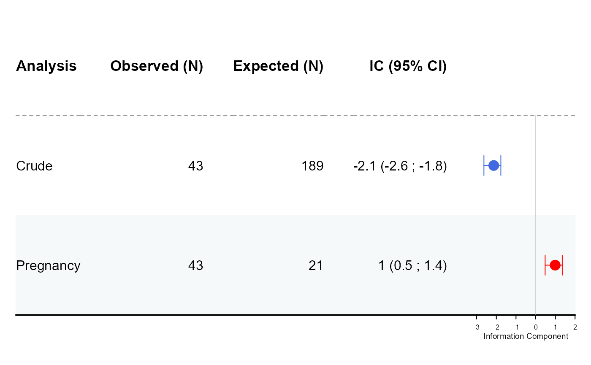

# Getting Started

### Study Reference

This package was developed as part of the following study:

> **Exploring and Comparing Existing Algorithms for Flagging
> Pregnancy-related Adverse Event Reports**  
> *Sara Hedfors Vidlin, Valentina Giunchi, Levente K-Pápai, Lovisa
> Sandberg, Cosimo Zaccaria, Takamasa Sakai, Loris Piccolo, Elena Rocca,
> Michele Fusaroli, Nhung TH Trinh*

## PVgravID: Identifying Pregnancy Reports in Pharmacovigilance Databases

### Overview

**PVgravID** is an R package for the identification and comparison of
pregnancy-related reports in large pharmacovigilance databases,
specifically VigiBase and FAERS. It implements and harmonizes three
published rule-based algorithms for flagging pregnancy-related adverse
event reports, enabling researchers to systematically retrieve, compare,
and analyze such reports across different data sources.

### Background

Pregnant individuals are often excluded from clinical trials, making
post-marketing surveillance crucial for understanding drug safety in
this population. However, the lack of a standardized pregnancy indicator
in adverse event reporting complicates the identification of relevant
cases. Three rule-based algorithms have been developed to address this,
each tailored to a specific database (FAERS, EudraVigilance, VigiBase)
and with different scopes and rationales. PVgravID harmonizes and
implements these algorithms, allowing direct comparison and application
to both VigiBase and FAERS datasets.

### Features

- Implements three published algorithms for identifying
  pregnancy-related reports:
  1.  [Sakai T, Ohtsu F, Sekiya Y, et al (2016) Methodology for
      Estimating the Risk of Adverse Drug Reactions in Pregnant Women:
      Analysis of the Japanese Adverse Drug Event Report Database.
      Yakugaku Zasshi
      136:499–505.](https://doi.org/10.1248/yakushi.15-00235)
  2.  [Zaccaria C, Piccolo L, Gordillo-Marañón M, et al (2024)
      Identification of Pregnancy Adverse Drug Reactions in
      Pharmacovigilance Reporting Systems: A Novel Algorithm Developed
      in EudraVigilance. Drug Saf
      47:1127–1136.](https://doi.org/10.1007/s40264-024-01448-y)
  3.  [Sandberg L, Vidlin SH, K-Pápai L, et al (2025) Uncovering
      Pregnancy Exposures in Pharmacovigilance Case Report Databases: A
      Comprehensive Evaluation of the VigiBase Pregnancy Algorithm. Drug
      Saf.](https://doi.org/10.1007/s40264-025-01559-0)
- Harmonized logic for cross-database comparison
- Function to tailor the algorithms to the researcher specific need
- Functions for descriptive analysis and visualization (Venn diagrams,
  upset plots)
- Interoperable with the
  [DiAna](https://github.com/fusarolimichele/DiAnDiAna_packagea) R
  package for pharmacovigilance data

### Installation

PVgravID is not yet on CRAN. To install from source:

``` r

# install.packages("pak")
pak::pak("Uppsala-Monitoring-Centre/PVgravID")
```

### Data

This project used both VigiBase data (as available to the Uppsala
Monitoring Centre) and FAERS data (as provided in a cleaned form by the
DiAna package. To install it follow the instruction at the
<https://github.com/fusarolimichele/DiAna_package> github.

The following script will use the FAERS data, because of it ready
availability to the public. The package expects input data in the format
used by the DiAna package, with data tables for demographics, drugs,
reactions, indications, outcomes, etc.

### Usage

We first import the library used and, following DiAna workflow, we
define the last quarter of the FAERS we want to work with: “25Q1”. Note
that all the quarters previous to it will also be included. We then
import all the demographic data up to 25Q1.

``` r

library(PVgravID)
library(DiAna)
library(dplyr)
FAERS_version <- "25Q1"
import("DEMO")
#>           primaryid    sex age_in_days wt_in_kgs             occr_country
#>               <num> <fctr>       <num>     <num>                   <fctr>
#>        1:  45217461      M        9855        NA                     <NA>
#>        2:  57910401   <NA>          NA        NA                     <NA>
#>        3:  56962401   <NA>          NA        NA                     <NA>
#>        4:  54662121      F       22630        NA                     <NA>
#>        5:  31231172      F       21535        68                     <NA>
#>       ---                                                                
#> 18907378: 251464781      F        6205        59                     <NA>
#> 18907379: 251466471      F       18980        NA                     <NA>
#> 18907380: 251466491      M       29200        85                     <NA>
#> 18907381: 251466861      M       12410        NA                     <NA>
#> 18907382:  70283934   <NA>          NA        NA United States of America
#>           event_dt occp_cod          reporter_country rept_cod init_fda_dt
#>              <int>   <fctr>                    <fctr>   <fctr>       <int>
#>        1: 19861106       MD  United States of America      DIR    19861224
#>        2:       NA     <NA>  United States of America      DIR    19920917
#>        3: 19960123     <NA>  United States of America      DIR    19960126
#>        4: 19960919       CN South Africa, Republic of      EXP    19961022
#>        5: 19970927       MD  United States of America      EXP    19971203
#>       ---                                                                 
#> 18907378: 20250331       PH  United States of America      DIR    20250331
#> 18907379: 20250308       HP  United States of America      DIR    20250331
#> 18907380: 20250326       PH  United States of America      DIR    20250331
#> 18907381: 20250331       PH  United States of America      DIR    20250331
#> 18907382:       NA       PH  United States of America      EXP    20090619
#>             fda_dt premarketing literature RB_duplicates
#>              <int>       <lgcl>     <lgcl>        <lgcl>
#>        1: 19861224        FALSE      FALSE         FALSE
#>        2: 19920917        FALSE      FALSE         FALSE
#>        3: 19960126        FALSE      FALSE         FALSE
#>        4: 19961022        FALSE      FALSE         FALSE
#>        5: 19971212        FALSE      FALSE         FALSE
#>       ---                                               
#> 18907378: 20250331        FALSE      FALSE         FALSE
#> 18907379: 20250331        FALSE      FALSE         FALSE
#> 18907380: 20250331        FALSE      FALSE         FALSE
#> 18907381: 20250331        FALSE      FALSE         FALSE
#> 18907382: 20250331        FALSE      FALSE         FALSE
#>           RB_duplicates_only_susp
#>                            <lgcl>
#>        1:                   FALSE
#>        2:                   FALSE
#>        3:                   FALSE
#>        4:                   FALSE
#>        5:                   FALSE
#>       ---                        
#> 18907378:                   FALSE
#> 18907379:                   FALSE
#> 18907380:                   FALSE
#> 18907381:                   FALSE
#> 18907382:                   FALSE
```

#### Retrieve Pregnancy Reports

The main function of the package is generate_pregnancy_flags, which
takes a list of report identifiers (in our case all the reports included
in Demo) and import them from the data folder included in the same
project folder (as in the DiAna directory structure), and assess each
report for the inclusion and exclusion criteria of the three different
pregnancy algorithms.

``` r

matrix_flagged_for_pregnancy <- generate_pregnancy_flags(pids_vct = Demo$primaryid)
```

``` r

kable(head(matrix_flagged_for_pregnancy, 100), format = "html") |>
  kable_styling(full_width = FALSE) |>
  scroll_box(height = "400px")
```

| primaryid | E_age_over_50y | E_agegroup_elderly | E_parent_M | E_reac_paternal | E_reac_normalCombined | E_reac_noADR | E_indi_normalCombined | I_gestation | I_route_transplacental | I_route_intramniotic | I_route_extraamniotic | I_indi_exposure_matACunkA | I_indi_exposure_mater_B | I_indi_exposure_nolact | I_indi_fet_abo_pregn_norm | I_reac_exposure_matACunkA | I_reac_exposure_matB | I_reac_fet_abo_pregn | I_reac_normal | I_reac_cong_below_2 | I_reac_cong_CA | I_reac_cong_parent | I_reac_neon_below_8days | I_reac_neon_CA | I_reac_neon_parent | I_parent_F_nolac | I_serious_CA | I_concurrent_pregn | I_reac_neon_cong | I_indi_fet_pregn_norm | E_nofertile_F | E_indi_paternal | E_reac_paternal_Sakai | E_indi_congenital | UMC | EMA | SakaiHPPV | SakaiHS | SakaiM |
|---:|:---|:---|:---|:---|:---|:---|:---|:---|:---|:---|:---|:---|:---|:---|:---|:---|:---|:---|:---|:---|:---|:---|:---|:---|:---|:---|:---|:---|:---|:---|:---|:---|:---|:---|:---|:---|:---|:---|:---|
| 45217461 | FALSE | NA | NA | FALSE | FALSE | FALSE | FALSE | NA | FALSE | FALSE | FALSE | FALSE | FALSE | FALSE | FALSE | FALSE | FALSE | FALSE | FALSE | FALSE | FALSE | NA | FALSE | FALSE | NA | NA | FALSE | NA | FALSE | FALSE | TRUE | FALSE | FALSE | FALSE | FALSE | FALSE | FALSE | FALSE | FALSE |
| 57910401 | FALSE | NA | NA | FALSE | FALSE | FALSE | FALSE | NA | FALSE | FALSE | FALSE | FALSE | FALSE | FALSE | FALSE | FALSE | FALSE | FALSE | FALSE | FALSE | FALSE | NA | FALSE | FALSE | NA | NA | FALSE | NA | FALSE | FALSE | TRUE | FALSE | FALSE | FALSE | FALSE | FALSE | FALSE | FALSE | FALSE |
| 56962401 | FALSE | NA | NA | FALSE | FALSE | FALSE | FALSE | NA | FALSE | FALSE | FALSE | FALSE | FALSE | FALSE | FALSE | FALSE | FALSE | FALSE | FALSE | FALSE | FALSE | NA | FALSE | FALSE | NA | NA | FALSE | NA | FALSE | FALSE | TRUE | FALSE | FALSE | FALSE | FALSE | FALSE | FALSE | FALSE | FALSE |
| 54662121 | TRUE | NA | NA | FALSE | FALSE | FALSE | FALSE | NA | FALSE | FALSE | FALSE | FALSE | FALSE | FALSE | FALSE | FALSE | FALSE | FALSE | FALSE | FALSE | FALSE | NA | FALSE | FALSE | NA | NA | FALSE | NA | FALSE | FALSE | TRUE | FALSE | FALSE | FALSE | FALSE | FALSE | FALSE | FALSE | FALSE |
| 31231172 | TRUE | NA | NA | FALSE | FALSE | FALSE | FALSE | NA | FALSE | FALSE | FALSE | FALSE | FALSE | FALSE | FALSE | FALSE | FALSE | FALSE | FALSE | FALSE | FALSE | NA | FALSE | FALSE | NA | NA | FALSE | NA | TRUE | FALSE | TRUE | FALSE | FALSE | FALSE | FALSE | FALSE | FALSE | TRUE | FALSE |
| 30307871 | FALSE | NA | NA | FALSE | FALSE | FALSE | FALSE | NA | FALSE | FALSE | FALSE | FALSE | FALSE | FALSE | FALSE | FALSE | FALSE | FALSE | FALSE | FALSE | FALSE | NA | FALSE | FALSE | NA | NA | FALSE | NA | FALSE | FALSE | TRUE | FALSE | FALSE | FALSE | FALSE | FALSE | FALSE | FALSE | FALSE |
| 31273651 | FALSE | NA | NA | FALSE | FALSE | FALSE | FALSE | NA | FALSE | FALSE | FALSE | FALSE | FALSE | FALSE | FALSE | FALSE | FALSE | FALSE | FALSE | FALSE | FALSE | NA | FALSE | FALSE | NA | NA | FALSE | NA | FALSE | FALSE | TRUE | FALSE | FALSE | FALSE | FALSE | FALSE | FALSE | FALSE | FALSE |
| 32427281 | FALSE | NA | NA | FALSE | FALSE | FALSE | FALSE | NA | FALSE | FALSE | FALSE | FALSE | FALSE | FALSE | FALSE | FALSE | FALSE | FALSE | FALSE | FALSE | FALSE | NA | FALSE | FALSE | NA | NA | FALSE | NA | FALSE | FALSE | FALSE | FALSE | FALSE | FALSE | FALSE | FALSE | FALSE | FALSE | FALSE |
| 37847331 | TRUE | NA | NA | FALSE | FALSE | FALSE | FALSE | NA | FALSE | FALSE | FALSE | FALSE | FALSE | FALSE | FALSE | FALSE | FALSE | FALSE | FALSE | FALSE | FALSE | NA | FALSE | FALSE | NA | NA | FALSE | NA | FALSE | FALSE | TRUE | FALSE | FALSE | FALSE | FALSE | FALSE | FALSE | FALSE | FALSE |
| 32030921 | FALSE | NA | NA | FALSE | FALSE | FALSE | FALSE | NA | FALSE | FALSE | FALSE | FALSE | FALSE | FALSE | FALSE | FALSE | FALSE | FALSE | FALSE | FALSE | FALSE | NA | FALSE | FALSE | NA | NA | FALSE | NA | FALSE | FALSE | FALSE | FALSE | FALSE | FALSE | FALSE | FALSE | FALSE | FALSE | FALSE |
| 32138152 | TRUE | NA | NA | FALSE | FALSE | FALSE | FALSE | NA | FALSE | FALSE | FALSE | FALSE | FALSE | FALSE | FALSE | FALSE | FALSE | FALSE | FALSE | FALSE | FALSE | NA | FALSE | FALSE | NA | NA | FALSE | NA | FALSE | FALSE | TRUE | FALSE | FALSE | FALSE | FALSE | FALSE | FALSE | FALSE | FALSE |
| 53633692 | TRUE | NA | NA | FALSE | FALSE | FALSE | FALSE | NA | FALSE | FALSE | FALSE | FALSE | FALSE | FALSE | FALSE | FALSE | FALSE | FALSE | FALSE | FALSE | FALSE | NA | FALSE | FALSE | NA | NA | FALSE | NA | FALSE | FALSE | TRUE | FALSE | FALSE | FALSE | FALSE | FALSE | FALSE | FALSE | FALSE |
| 32077533 | FALSE | NA | NA | FALSE | FALSE | FALSE | FALSE | NA | FALSE | FALSE | FALSE | FALSE | FALSE | FALSE | FALSE | FALSE | FALSE | FALSE | FALSE | FALSE | FALSE | NA | FALSE | FALSE | NA | NA | FALSE | NA | FALSE | FALSE | FALSE | FALSE | FALSE | FALSE | FALSE | FALSE | FALSE | FALSE | FALSE |
| 32077683 | FALSE | NA | NA | FALSE | FALSE | FALSE | FALSE | NA | FALSE | FALSE | FALSE | FALSE | FALSE | FALSE | FALSE | FALSE | FALSE | FALSE | FALSE | FALSE | FALSE | NA | FALSE | FALSE | NA | NA | FALSE | NA | FALSE | FALSE | FALSE | FALSE | FALSE | FALSE | FALSE | FALSE | FALSE | FALSE | FALSE |
| 32223462 | FALSE | NA | NA | FALSE | FALSE | FALSE | FALSE | NA | FALSE | FALSE | FALSE | FALSE | FALSE | FALSE | FALSE | FALSE | FALSE | FALSE | FALSE | FALSE | FALSE | NA | FALSE | FALSE | NA | NA | FALSE | NA | FALSE | FALSE | TRUE | FALSE | FALSE | FALSE | FALSE | FALSE | FALSE | FALSE | FALSE |
| 41860621 | FALSE | NA | NA | FALSE | FALSE | FALSE | FALSE | NA | FALSE | FALSE | FALSE | FALSE | FALSE | FALSE | FALSE | FALSE | FALSE | FALSE | FALSE | FALSE | FALSE | NA | FALSE | FALSE | NA | NA | FALSE | NA | FALSE | FALSE | FALSE | FALSE | FALSE | FALSE | FALSE | FALSE | FALSE | FALSE | FALSE |
| 32908311 | TRUE | NA | NA | FALSE | FALSE | FALSE | FALSE | NA | FALSE | FALSE | FALSE | FALSE | FALSE | FALSE | FALSE | FALSE | FALSE | FALSE | FALSE | FALSE | FALSE | NA | FALSE | FALSE | NA | NA | FALSE | NA | FALSE | FALSE | TRUE | FALSE | FALSE | FALSE | FALSE | FALSE | FALSE | FALSE | FALSE |
| 33069461 | FALSE | NA | NA | FALSE | FALSE | FALSE | FALSE | NA | FALSE | FALSE | FALSE | FALSE | FALSE | FALSE | FALSE | FALSE | FALSE | FALSE | FALSE | FALSE | FALSE | NA | FALSE | FALSE | NA | NA | FALSE | NA | FALSE | FALSE | TRUE | FALSE | FALSE | FALSE | FALSE | FALSE | FALSE | FALSE | FALSE |
| 32545282 | TRUE | NA | NA | FALSE | FALSE | FALSE | FALSE | NA | FALSE | FALSE | FALSE | FALSE | FALSE | FALSE | FALSE | FALSE | FALSE | FALSE | FALSE | FALSE | FALSE | NA | FALSE | FALSE | NA | NA | FALSE | NA | FALSE | FALSE | TRUE | FALSE | FALSE | FALSE | FALSE | FALSE | FALSE | FALSE | FALSE |
| 33116181 | TRUE | NA | NA | FALSE | FALSE | FALSE | FALSE | NA | FALSE | FALSE | FALSE | FALSE | FALSE | FALSE | FALSE | FALSE | FALSE | FALSE | FALSE | FALSE | FALSE | NA | FALSE | FALSE | NA | NA | FALSE | NA | FALSE | FALSE | TRUE | FALSE | FALSE | FALSE | FALSE | FALSE | FALSE | FALSE | FALSE |
| 33189951 | TRUE | NA | NA | FALSE | FALSE | FALSE | FALSE | NA | FALSE | FALSE | FALSE | FALSE | FALSE | FALSE | FALSE | FALSE | FALSE | FALSE | FALSE | FALSE | FALSE | NA | FALSE | FALSE | NA | NA | FALSE | NA | FALSE | FALSE | TRUE | FALSE | FALSE | FALSE | FALSE | FALSE | FALSE | FALSE | FALSE |
| 33249531 | TRUE | NA | NA | FALSE | FALSE | FALSE | FALSE | NA | FALSE | FALSE | FALSE | FALSE | FALSE | FALSE | FALSE | FALSE | FALSE | FALSE | FALSE | FALSE | FALSE | NA | FALSE | FALSE | NA | NA | FALSE | NA | FALSE | FALSE | FALSE | FALSE | FALSE | FALSE | FALSE | FALSE | FALSE | FALSE | FALSE |
| 32927213 | FALSE | NA | NA | FALSE | FALSE | FALSE | FALSE | NA | FALSE | FALSE | FALSE | FALSE | FALSE | FALSE | FALSE | FALSE | FALSE | FALSE | FALSE | FALSE | FALSE | NA | FALSE | FALSE | NA | NA | FALSE | NA | FALSE | FALSE | TRUE | FALSE | FALSE | FALSE | FALSE | FALSE | FALSE | FALSE | FALSE |
| 33576892 | FALSE | NA | NA | FALSE | FALSE | FALSE | FALSE | NA | FALSE | FALSE | FALSE | FALSE | FALSE | FALSE | FALSE | FALSE | FALSE | FALSE | FALSE | FALSE | FALSE | NA | FALSE | FALSE | NA | NA | FALSE | NA | FALSE | FALSE | FALSE | FALSE | FALSE | FALSE | FALSE | FALSE | FALSE | FALSE | FALSE |
| 33914632 | TRUE | NA | NA | FALSE | FALSE | FALSE | FALSE | NA | FALSE | FALSE | FALSE | FALSE | FALSE | FALSE | FALSE | FALSE | FALSE | FALSE | FALSE | FALSE | FALSE | NA | FALSE | FALSE | NA | NA | FALSE | NA | FALSE | FALSE | TRUE | FALSE | FALSE | FALSE | FALSE | FALSE | FALSE | FALSE | FALSE |
| 34331911 | TRUE | NA | NA | FALSE | FALSE | FALSE | FALSE | NA | FALSE | FALSE | FALSE | FALSE | FALSE | FALSE | FALSE | FALSE | FALSE | FALSE | FALSE | FALSE | FALSE | NA | FALSE | FALSE | NA | NA | FALSE | NA | FALSE | FALSE | TRUE | FALSE | FALSE | FALSE | FALSE | FALSE | FALSE | FALSE | FALSE |
| 57697232 | TRUE | NA | NA | FALSE | FALSE | FALSE | FALSE | NA | FALSE | FALSE | FALSE | FALSE | FALSE | FALSE | FALSE | FALSE | FALSE | FALSE | FALSE | FALSE | FALSE | NA | FALSE | FALSE | NA | NA | FALSE | NA | FALSE | FALSE | TRUE | FALSE | FALSE | FALSE | FALSE | FALSE | FALSE | FALSE | FALSE |
| 34460354 | FALSE | NA | NA | FALSE | FALSE | FALSE | FALSE | NA | FALSE | FALSE | FALSE | FALSE | FALSE | FALSE | FALSE | FALSE | FALSE | FALSE | FALSE | FALSE | FALSE | NA | FALSE | FALSE | NA | NA | FALSE | NA | FALSE | FALSE | TRUE | FALSE | FALSE | FALSE | FALSE | FALSE | FALSE | FALSE | FALSE |
| 66685672 | FALSE | NA | NA | FALSE | FALSE | FALSE | FALSE | NA | FALSE | FALSE | FALSE | FALSE | FALSE | FALSE | FALSE | FALSE | FALSE | FALSE | FALSE | FALSE | FALSE | NA | FALSE | FALSE | NA | NA | FALSE | NA | FALSE | FALSE | FALSE | FALSE | FALSE | FALSE | FALSE | FALSE | FALSE | FALSE | FALSE |
| 35653763 | TRUE | NA | NA | FALSE | FALSE | FALSE | FALSE | NA | FALSE | FALSE | FALSE | FALSE | FALSE | FALSE | FALSE | FALSE | FALSE | FALSE | FALSE | FALSE | FALSE | NA | FALSE | FALSE | NA | NA | FALSE | NA | FALSE | FALSE | TRUE | FALSE | FALSE | FALSE | FALSE | FALSE | FALSE | FALSE | FALSE |
| 35750711 | FALSE | NA | NA | FALSE | FALSE | FALSE | FALSE | NA | FALSE | FALSE | FALSE | FALSE | FALSE | FALSE | FALSE | FALSE | FALSE | FALSE | FALSE | FALSE | FALSE | NA | FALSE | FALSE | NA | NA | FALSE | NA | FALSE | FALSE | TRUE | FALSE | FALSE | FALSE | FALSE | FALSE | FALSE | FALSE | FALSE |
| 35764423 | TRUE | NA | NA | FALSE | FALSE | FALSE | FALSE | NA | FALSE | FALSE | FALSE | FALSE | FALSE | FALSE | FALSE | FALSE | FALSE | FALSE | FALSE | FALSE | FALSE | NA | FALSE | FALSE | NA | NA | FALSE | NA | FALSE | FALSE | TRUE | FALSE | FALSE | FALSE | FALSE | FALSE | FALSE | FALSE | FALSE |
| 36299761 | FALSE | NA | NA | FALSE | FALSE | FALSE | FALSE | NA | FALSE | FALSE | FALSE | FALSE | FALSE | FALSE | FALSE | FALSE | FALSE | FALSE | FALSE | FALSE | FALSE | NA | FALSE | FALSE | NA | NA | FALSE | NA | FALSE | FALSE | TRUE | FALSE | FALSE | FALSE | FALSE | FALSE | FALSE | FALSE | FALSE |
| 39884842 | TRUE | NA | NA | FALSE | FALSE | FALSE | FALSE | NA | FALSE | FALSE | FALSE | FALSE | FALSE | FALSE | FALSE | FALSE | FALSE | FALSE | FALSE | FALSE | FALSE | NA | FALSE | FALSE | NA | NA | FALSE | NA | FALSE | FALSE | TRUE | FALSE | FALSE | FALSE | FALSE | FALSE | FALSE | FALSE | FALSE |
| 61584552 | FALSE | NA | NA | FALSE | FALSE | FALSE | FALSE | NA | FALSE | FALSE | FALSE | FALSE | FALSE | FALSE | FALSE | FALSE | FALSE | FALSE | FALSE | FALSE | FALSE | NA | FALSE | FALSE | NA | NA | FALSE | NA | FALSE | FALSE | TRUE | FALSE | FALSE | FALSE | FALSE | FALSE | FALSE | FALSE | FALSE |
| 37225011 | FALSE | NA | NA | FALSE | FALSE | FALSE | FALSE | NA | FALSE | FALSE | FALSE | FALSE | FALSE | FALSE | FALSE | FALSE | FALSE | FALSE | FALSE | FALSE | FALSE | NA | FALSE | FALSE | NA | NA | FALSE | NA | FALSE | FALSE | TRUE | FALSE | FALSE | FALSE | FALSE | FALSE | FALSE | FALSE | FALSE |
| 37293841 | TRUE | NA | NA | FALSE | FALSE | FALSE | FALSE | NA | FALSE | FALSE | FALSE | FALSE | FALSE | FALSE | FALSE | FALSE | FALSE | FALSE | FALSE | FALSE | FALSE | NA | FALSE | FALSE | NA | NA | FALSE | NA | FALSE | FALSE | TRUE | FALSE | FALSE | FALSE | FALSE | FALSE | FALSE | FALSE | FALSE |
| 37209972 | FALSE | NA | NA | FALSE | FALSE | FALSE | FALSE | NA | FALSE | FALSE | FALSE | FALSE | FALSE | FALSE | FALSE | FALSE | FALSE | FALSE | FALSE | FALSE | FALSE | NA | FALSE | FALSE | NA | NA | FALSE | NA | FALSE | FALSE | TRUE | FALSE | FALSE | FALSE | FALSE | FALSE | FALSE | FALSE | FALSE |
| 80351361 | FALSE | NA | NA | FALSE | FALSE | FALSE | FALSE | NA | FALSE | FALSE | FALSE | FALSE | FALSE | FALSE | FALSE | FALSE | FALSE | FALSE | FALSE | FALSE | FALSE | NA | FALSE | FALSE | NA | NA | FALSE | NA | FALSE | FALSE | TRUE | FALSE | FALSE | FALSE | FALSE | FALSE | FALSE | FALSE | FALSE |
| 37592244 | FALSE | NA | NA | FALSE | FALSE | FALSE | FALSE | NA | FALSE | FALSE | FALSE | FALSE | FALSE | FALSE | FALSE | FALSE | FALSE | FALSE | FALSE | FALSE | FALSE | NA | FALSE | FALSE | NA | NA | FALSE | NA | FALSE | FALSE | FALSE | FALSE | FALSE | FALSE | FALSE | FALSE | FALSE | FALSE | FALSE |
| 32976884 | TRUE | NA | NA | FALSE | FALSE | FALSE | FALSE | NA | FALSE | FALSE | FALSE | FALSE | FALSE | FALSE | FALSE | FALSE | FALSE | FALSE | FALSE | FALSE | FALSE | NA | FALSE | FALSE | NA | NA | FALSE | NA | FALSE | FALSE | TRUE | FALSE | FALSE | FALSE | FALSE | FALSE | FALSE | FALSE | FALSE |
| 36317988 | FALSE | NA | NA | FALSE | FALSE | FALSE | TRUE | NA | FALSE | FALSE | FALSE | FALSE | FALSE | FALSE | FALSE | FALSE | FALSE | FALSE | FALSE | FALSE | FALSE | NA | FALSE | FALSE | NA | NA | FALSE | NA | FALSE | FALSE | FALSE | FALSE | FALSE | FALSE | FALSE | FALSE | FALSE | FALSE | FALSE |
| 38131791 | TRUE | NA | NA | FALSE | FALSE | FALSE | FALSE | NA | FALSE | FALSE | FALSE | FALSE | FALSE | FALSE | FALSE | FALSE | FALSE | FALSE | FALSE | FALSE | FALSE | NA | FALSE | FALSE | NA | NA | FALSE | NA | FALSE | FALSE | TRUE | FALSE | FALSE | FALSE | FALSE | FALSE | FALSE | FALSE | FALSE |
| 38675501 | FALSE | NA | NA | FALSE | FALSE | FALSE | FALSE | NA | FALSE | FALSE | FALSE | FALSE | FALSE | FALSE | FALSE | FALSE | FALSE | FALSE | FALSE | FALSE | FALSE | NA | FALSE | FALSE | NA | NA | FALSE | NA | FALSE | FALSE | FALSE | FALSE | FALSE | FALSE | FALSE | FALSE | FALSE | FALSE | FALSE |
| 66877291 | TRUE | NA | NA | FALSE | FALSE | FALSE | FALSE | NA | FALSE | FALSE | FALSE | FALSE | FALSE | FALSE | FALSE | FALSE | FALSE | FALSE | FALSE | FALSE | FALSE | NA | FALSE | FALSE | NA | NA | FALSE | NA | FALSE | FALSE | TRUE | FALSE | FALSE | FALSE | FALSE | FALSE | FALSE | FALSE | FALSE |
| 39497921 | TRUE | NA | NA | FALSE | FALSE | FALSE | FALSE | NA | FALSE | FALSE | FALSE | FALSE | FALSE | FALSE | FALSE | FALSE | FALSE | FALSE | FALSE | FALSE | FALSE | NA | FALSE | FALSE | NA | NA | FALSE | NA | FALSE | FALSE | TRUE | FALSE | FALSE | FALSE | FALSE | FALSE | FALSE | FALSE | FALSE |
| 39666531 | FALSE | NA | NA | FALSE | FALSE | FALSE | FALSE | NA | FALSE | FALSE | FALSE | FALSE | FALSE | FALSE | FALSE | FALSE | FALSE | FALSE | FALSE | FALSE | FALSE | NA | FALSE | FALSE | NA | NA | FALSE | NA | FALSE | FALSE | FALSE | FALSE | FALSE | FALSE | FALSE | FALSE | FALSE | FALSE | FALSE |
| 39306567 | FALSE | NA | NA | FALSE | FALSE | FALSE | FALSE | NA | FALSE | FALSE | FALSE | FALSE | FALSE | FALSE | FALSE | FALSE | FALSE | FALSE | FALSE | FALSE | FALSE | NA | FALSE | FALSE | NA | NA | FALSE | NA | FALSE | FALSE | FALSE | FALSE | FALSE | FALSE | FALSE | FALSE | FALSE | FALSE | FALSE |
| 40054651 | FALSE | NA | NA | FALSE | FALSE | FALSE | FALSE | NA | FALSE | FALSE | FALSE | FALSE | FALSE | FALSE | FALSE | FALSE | FALSE | FALSE | FALSE | FALSE | FALSE | NA | FALSE | FALSE | NA | NA | FALSE | NA | FALSE | FALSE | FALSE | FALSE | FALSE | FALSE | FALSE | FALSE | FALSE | FALSE | FALSE |
| 4204616 | FALSE | NA | NA | FALSE | FALSE | FALSE | FALSE | NA | FALSE | FALSE | FALSE | FALSE | FALSE | FALSE | TRUE | FALSE | FALSE | FALSE | FALSE | FALSE | FALSE | NA | FALSE | FALSE | NA | NA | FALSE | NA | FALSE | FALSE | FALSE | FALSE | FALSE | FALSE | TRUE | FALSE | FALSE | FALSE | FALSE |
| 4214534 | FALSE | NA | NA | FALSE | FALSE | FALSE | FALSE | NA | FALSE | FALSE | FALSE | FALSE | FALSE | FALSE | FALSE | FALSE | FALSE | FALSE | FALSE | FALSE | FALSE | NA | FALSE | FALSE | NA | NA | FALSE | NA | FALSE | FALSE | FALSE | FALSE | FALSE | FALSE | FALSE | FALSE | FALSE | FALSE | FALSE |
| 4223542 | FALSE | NA | NA | FALSE | FALSE | FALSE | FALSE | NA | FALSE | FALSE | FALSE | FALSE | FALSE | FALSE | FALSE | FALSE | FALSE | FALSE | FALSE | FALSE | FALSE | NA | FALSE | FALSE | NA | NA | FALSE | NA | FALSE | FALSE | TRUE | FALSE | FALSE | FALSE | FALSE | FALSE | FALSE | FALSE | FALSE |
| 4266082 | TRUE | NA | NA | FALSE | FALSE | FALSE | FALSE | NA | FALSE | FALSE | FALSE | FALSE | FALSE | FALSE | FALSE | FALSE | FALSE | FALSE | FALSE | FALSE | FALSE | NA | FALSE | FALSE | NA | NA | FALSE | NA | FALSE | FALSE | TRUE | FALSE | FALSE | FALSE | FALSE | FALSE | FALSE | FALSE | FALSE |
| 4250482 | FALSE | NA | NA | FALSE | FALSE | FALSE | FALSE | NA | FALSE | FALSE | FALSE | FALSE | FALSE | FALSE | FALSE | FALSE | FALSE | FALSE | FALSE | FALSE | FALSE | NA | FALSE | FALSE | NA | NA | FALSE | NA | FALSE | FALSE | TRUE | FALSE | FALSE | FALSE | FALSE | FALSE | FALSE | FALSE | FALSE |
| 39876187 | TRUE | NA | NA | FALSE | FALSE | FALSE | FALSE | NA | FALSE | FALSE | FALSE | FALSE | FALSE | FALSE | FALSE | FALSE | FALSE | FALSE | FALSE | FALSE | FALSE | NA | FALSE | FALSE | NA | NA | FALSE | NA | FALSE | FALSE | TRUE | FALSE | FALSE | FALSE | FALSE | FALSE | FALSE | FALSE | FALSE |
| 40456612 | TRUE | NA | NA | FALSE | FALSE | FALSE | FALSE | NA | FALSE | FALSE | FALSE | FALSE | FALSE | FALSE | FALSE | FALSE | FALSE | FALSE | FALSE | FALSE | FALSE | NA | FALSE | FALSE | NA | NA | FALSE | NA | FALSE | FALSE | TRUE | FALSE | FALSE | FALSE | FALSE | FALSE | FALSE | FALSE | FALSE |
| 40558331 | FALSE | NA | NA | FALSE | FALSE | FALSE | FALSE | NA | FALSE | FALSE | FALSE | FALSE | FALSE | FALSE | FALSE | FALSE | FALSE | FALSE | FALSE | FALSE | FALSE | NA | FALSE | FALSE | NA | NA | FALSE | NA | FALSE | FALSE | TRUE | FALSE | FALSE | FALSE | FALSE | FALSE | FALSE | FALSE | FALSE |
| 4280585 | FALSE | NA | NA | FALSE | FALSE | FALSE | FALSE | NA | FALSE | FALSE | FALSE | FALSE | FALSE | FALSE | FALSE | FALSE | FALSE | FALSE | FALSE | FALSE | FALSE | NA | FALSE | FALSE | NA | NA | FALSE | NA | FALSE | FALSE | TRUE | FALSE | FALSE | FALSE | FALSE | FALSE | FALSE | FALSE | FALSE |
| 4261823 | TRUE | NA | NA | FALSE | FALSE | FALSE | FALSE | NA | FALSE | FALSE | FALSE | FALSE | FALSE | FALSE | FALSE | FALSE | FALSE | FALSE | FALSE | FALSE | FALSE | NA | FALSE | FALSE | NA | NA | FALSE | NA | FALSE | FALSE | TRUE | FALSE | FALSE | FALSE | FALSE | FALSE | FALSE | FALSE | FALSE |
| 4261824 | TRUE | NA | NA | FALSE | FALSE | FALSE | FALSE | NA | FALSE | FALSE | FALSE | FALSE | FALSE | FALSE | FALSE | FALSE | FALSE | FALSE | FALSE | FALSE | FALSE | NA | FALSE | FALSE | NA | NA | FALSE | NA | FALSE | FALSE | TRUE | FALSE | FALSE | FALSE | FALSE | FALSE | FALSE | FALSE | FALSE |
| 4261825 | TRUE | NA | NA | FALSE | FALSE | FALSE | FALSE | NA | FALSE | FALSE | FALSE | FALSE | FALSE | FALSE | FALSE | FALSE | FALSE | FALSE | FALSE | FALSE | FALSE | NA | FALSE | FALSE | NA | NA | FALSE | NA | FALSE | FALSE | TRUE | FALSE | FALSE | FALSE | FALSE | FALSE | FALSE | FALSE | FALSE |
| 4261827 | FALSE | NA | NA | FALSE | FALSE | FALSE | FALSE | NA | FALSE | FALSE | FALSE | FALSE | FALSE | FALSE | FALSE | FALSE | FALSE | FALSE | FALSE | FALSE | FALSE | NA | FALSE | FALSE | NA | NA | FALSE | NA | FALSE | FALSE | TRUE | FALSE | FALSE | FALSE | FALSE | FALSE | FALSE | FALSE | FALSE |
| 4261863 | FALSE | NA | NA | FALSE | FALSE | FALSE | FALSE | NA | FALSE | FALSE | FALSE | FALSE | FALSE | FALSE | FALSE | FALSE | FALSE | FALSE | FALSE | FALSE | FALSE | NA | FALSE | FALSE | NA | NA | FALSE | NA | FALSE | FALSE | TRUE | FALSE | FALSE | FALSE | FALSE | FALSE | FALSE | FALSE | FALSE |
| 4261865 | FALSE | NA | NA | FALSE | FALSE | FALSE | FALSE | NA | FALSE | FALSE | FALSE | FALSE | FALSE | FALSE | FALSE | FALSE | FALSE | FALSE | FALSE | FALSE | FALSE | NA | FALSE | FALSE | NA | NA | FALSE | NA | FALSE | FALSE | TRUE | FALSE | FALSE | FALSE | FALSE | FALSE | FALSE | FALSE | FALSE |
| 4261870 | FALSE | NA | NA | FALSE | FALSE | FALSE | FALSE | NA | FALSE | FALSE | FALSE | FALSE | FALSE | FALSE | FALSE | FALSE | FALSE | FALSE | FALSE | FALSE | FALSE | NA | FALSE | FALSE | NA | NA | FALSE | NA | FALSE | FALSE | TRUE | FALSE | FALSE | FALSE | FALSE | FALSE | FALSE | FALSE | FALSE |
| 4261871 | TRUE | NA | NA | FALSE | FALSE | FALSE | FALSE | NA | FALSE | FALSE | FALSE | FALSE | FALSE | FALSE | FALSE | FALSE | FALSE | FALSE | FALSE | FALSE | FALSE | NA | FALSE | FALSE | NA | NA | FALSE | NA | FALSE | FALSE | TRUE | FALSE | FALSE | FALSE | FALSE | FALSE | FALSE | FALSE | FALSE |
| 4261878 | FALSE | NA | NA | FALSE | FALSE | FALSE | FALSE | NA | FALSE | FALSE | FALSE | FALSE | FALSE | FALSE | FALSE | FALSE | FALSE | FALSE | FALSE | FALSE | FALSE | NA | FALSE | FALSE | NA | NA | FALSE | NA | FALSE | FALSE | TRUE | FALSE | FALSE | FALSE | FALSE | FALSE | FALSE | FALSE | FALSE |
| 4261879 | FALSE | NA | NA | FALSE | FALSE | FALSE | FALSE | NA | FALSE | FALSE | FALSE | FALSE | FALSE | FALSE | FALSE | FALSE | FALSE | FALSE | FALSE | FALSE | FALSE | NA | FALSE | FALSE | NA | NA | FALSE | NA | FALSE | FALSE | TRUE | FALSE | FALSE | FALSE | FALSE | FALSE | FALSE | FALSE | FALSE |
| 4261986 | FALSE | NA | NA | FALSE | FALSE | FALSE | FALSE | NA | FALSE | FALSE | FALSE | FALSE | FALSE | FALSE | FALSE | FALSE | FALSE | FALSE | FALSE | FALSE | FALSE | NA | FALSE | FALSE | NA | NA | FALSE | NA | FALSE | FALSE | TRUE | FALSE | FALSE | FALSE | FALSE | FALSE | FALSE | FALSE | FALSE |
| 4261987 | FALSE | NA | NA | FALSE | FALSE | FALSE | FALSE | NA | FALSE | FALSE | FALSE | FALSE | FALSE | FALSE | FALSE | FALSE | FALSE | FALSE | FALSE | FALSE | FALSE | NA | FALSE | FALSE | NA | NA | FALSE | NA | FALSE | FALSE | TRUE | FALSE | FALSE | FALSE | FALSE | FALSE | FALSE | FALSE | FALSE |
| 4261996 | TRUE | NA | NA | FALSE | FALSE | FALSE | FALSE | NA | FALSE | FALSE | FALSE | FALSE | FALSE | FALSE | FALSE | FALSE | FALSE | FALSE | FALSE | FALSE | FALSE | NA | FALSE | FALSE | NA | NA | FALSE | NA | FALSE | FALSE | TRUE | FALSE | FALSE | FALSE | FALSE | FALSE | FALSE | FALSE | FALSE |
| 4262055 | FALSE | NA | NA | FALSE | FALSE | FALSE | FALSE | NA | FALSE | FALSE | FALSE | FALSE | FALSE | FALSE | FALSE | FALSE | FALSE | FALSE | FALSE | FALSE | FALSE | NA | FALSE | FALSE | NA | NA | FALSE | NA | FALSE | FALSE | TRUE | FALSE | FALSE | FALSE | FALSE | FALSE | FALSE | FALSE | FALSE |
| 4262057 | TRUE | NA | NA | FALSE | FALSE | FALSE | FALSE | NA | FALSE | FALSE | FALSE | FALSE | FALSE | FALSE | FALSE | FALSE | FALSE | FALSE | FALSE | FALSE | FALSE | NA | FALSE | FALSE | NA | NA | FALSE | NA | FALSE | FALSE | TRUE | FALSE | FALSE | FALSE | FALSE | FALSE | FALSE | FALSE | FALSE |
| 4262058 | TRUE | NA | NA | FALSE | FALSE | FALSE | FALSE | NA | FALSE | FALSE | FALSE | FALSE | FALSE | FALSE | FALSE | FALSE | FALSE | FALSE | FALSE | FALSE | FALSE | NA | FALSE | FALSE | NA | NA | FALSE | NA | FALSE | FALSE | TRUE | FALSE | FALSE | FALSE | FALSE | FALSE | FALSE | FALSE | FALSE |
| 4262059 | FALSE | NA | NA | FALSE | FALSE | FALSE | FALSE | NA | FALSE | FALSE | FALSE | FALSE | FALSE | FALSE | FALSE | FALSE | FALSE | FALSE | FALSE | FALSE | FALSE | NA | FALSE | FALSE | NA | NA | FALSE | NA | FALSE | FALSE | FALSE | FALSE | FALSE | FALSE | FALSE | FALSE | FALSE | FALSE | FALSE |
| 4262060 | TRUE | NA | NA | FALSE | FALSE | FALSE | FALSE | NA | FALSE | FALSE | FALSE | FALSE | FALSE | FALSE | FALSE | FALSE | FALSE | FALSE | FALSE | FALSE | FALSE | NA | FALSE | FALSE | NA | NA | FALSE | NA | FALSE | FALSE | TRUE | FALSE | FALSE | FALSE | FALSE | FALSE | FALSE | FALSE | FALSE |
| 4262061 | FALSE | NA | NA | FALSE | FALSE | FALSE | FALSE | NA | FALSE | FALSE | FALSE | FALSE | FALSE | FALSE | FALSE | FALSE | FALSE | FALSE | FALSE | FALSE | FALSE | NA | FALSE | FALSE | NA | NA | FALSE | NA | FALSE | FALSE | TRUE | FALSE | FALSE | FALSE | FALSE | FALSE | FALSE | FALSE | FALSE |
| 4262062 | TRUE | NA | NA | FALSE | FALSE | FALSE | FALSE | NA | FALSE | FALSE | FALSE | FALSE | FALSE | FALSE | FALSE | FALSE | FALSE | FALSE | FALSE | FALSE | FALSE | NA | FALSE | FALSE | NA | NA | FALSE | NA | FALSE | FALSE | TRUE | FALSE | FALSE | FALSE | FALSE | FALSE | FALSE | FALSE | FALSE |
| 4262066 | FALSE | NA | NA | FALSE | FALSE | FALSE | FALSE | NA | FALSE | FALSE | FALSE | FALSE | FALSE | FALSE | FALSE | FALSE | FALSE | FALSE | FALSE | FALSE | FALSE | NA | FALSE | FALSE | NA | NA | FALSE | NA | FALSE | FALSE | FALSE | FALSE | FALSE | FALSE | FALSE | FALSE | FALSE | FALSE | FALSE |
| 4262067 | FALSE | NA | NA | FALSE | FALSE | FALSE | FALSE | NA | FALSE | FALSE | FALSE | FALSE | FALSE | FALSE | FALSE | FALSE | FALSE | FALSE | FALSE | FALSE | FALSE | NA | FALSE | FALSE | NA | NA | FALSE | NA | FALSE | FALSE | FALSE | FALSE | FALSE | FALSE | FALSE | FALSE | FALSE | FALSE | FALSE |
| 4262072 | FALSE | NA | NA | FALSE | FALSE | FALSE | FALSE | NA | FALSE | FALSE | FALSE | FALSE | FALSE | FALSE | FALSE | FALSE | FALSE | FALSE | FALSE | FALSE | FALSE | NA | FALSE | FALSE | NA | NA | FALSE | NA | FALSE | FALSE | TRUE | FALSE | FALSE | FALSE | FALSE | FALSE | FALSE | FALSE | FALSE |
| 4262073 | FALSE | NA | NA | FALSE | FALSE | FALSE | FALSE | NA | FALSE | FALSE | FALSE | FALSE | FALSE | FALSE | FALSE | FALSE | FALSE | FALSE | FALSE | FALSE | FALSE | NA | FALSE | FALSE | NA | NA | FALSE | NA | FALSE | FALSE | TRUE | FALSE | FALSE | FALSE | FALSE | FALSE | FALSE | FALSE | FALSE |
| 4262074 | FALSE | NA | NA | FALSE | FALSE | FALSE | FALSE | NA | FALSE | FALSE | FALSE | FALSE | FALSE | FALSE | FALSE | FALSE | FALSE | FALSE | FALSE | FALSE | FALSE | NA | FALSE | FALSE | NA | NA | FALSE | NA | FALSE | FALSE | TRUE | FALSE | FALSE | FALSE | FALSE | FALSE | FALSE | FALSE | FALSE |
| 4262075 | FALSE | NA | NA | FALSE | FALSE | FALSE | FALSE | NA | FALSE | FALSE | FALSE | FALSE | FALSE | FALSE | FALSE | FALSE | FALSE | FALSE | FALSE | FALSE | FALSE | NA | FALSE | FALSE | NA | NA | FALSE | NA | FALSE | FALSE | TRUE | FALSE | FALSE | FALSE | FALSE | FALSE | FALSE | FALSE | FALSE |
| 4262076 | FALSE | NA | NA | FALSE | FALSE | FALSE | FALSE | NA | FALSE | FALSE | FALSE | FALSE | FALSE | FALSE | FALSE | FALSE | FALSE | FALSE | FALSE | FALSE | FALSE | NA | FALSE | FALSE | NA | NA | FALSE | NA | FALSE | FALSE | TRUE | FALSE | FALSE | FALSE | FALSE | FALSE | FALSE | FALSE | FALSE |
| 4262077 | TRUE | NA | NA | FALSE | FALSE | FALSE | FALSE | NA | FALSE | FALSE | FALSE | FALSE | FALSE | FALSE | FALSE | FALSE | FALSE | FALSE | FALSE | FALSE | FALSE | NA | FALSE | FALSE | NA | NA | FALSE | NA | FALSE | FALSE | TRUE | FALSE | FALSE | FALSE | FALSE | FALSE | FALSE | FALSE | FALSE |
| 4262079 | TRUE | NA | NA | FALSE | FALSE | FALSE | FALSE | NA | FALSE | FALSE | FALSE | FALSE | FALSE | FALSE | FALSE | FALSE | FALSE | FALSE | FALSE | FALSE | FALSE | NA | FALSE | FALSE | NA | NA | FALSE | NA | FALSE | FALSE | TRUE | FALSE | FALSE | FALSE | FALSE | FALSE | FALSE | FALSE | FALSE |
| 4262080 | TRUE | NA | NA | FALSE | FALSE | FALSE | FALSE | NA | FALSE | FALSE | FALSE | FALSE | FALSE | FALSE | FALSE | FALSE | FALSE | FALSE | FALSE | FALSE | FALSE | NA | FALSE | FALSE | NA | NA | FALSE | NA | FALSE | FALSE | TRUE | FALSE | FALSE | FALSE | FALSE | FALSE | FALSE | FALSE | FALSE |
| 4262084 | FALSE | NA | NA | FALSE | FALSE | FALSE | FALSE | NA | FALSE | FALSE | FALSE | FALSE | FALSE | FALSE | FALSE | FALSE | FALSE | FALSE | FALSE | FALSE | FALSE | NA | FALSE | FALSE | NA | NA | FALSE | NA | FALSE | FALSE | TRUE | FALSE | FALSE | FALSE | FALSE | FALSE | FALSE | FALSE | FALSE |
| 4262085 | FALSE | NA | NA | FALSE | FALSE | FALSE | FALSE | NA | FALSE | FALSE | FALSE | FALSE | FALSE | FALSE | FALSE | FALSE | FALSE | FALSE | FALSE | FALSE | FALSE | NA | FALSE | FALSE | NA | NA | FALSE | NA | FALSE | FALSE | FALSE | FALSE | FALSE | FALSE | FALSE | FALSE | FALSE | FALSE | FALSE |
| 4262088 | FALSE | NA | NA | FALSE | FALSE | FALSE | FALSE | NA | FALSE | FALSE | FALSE | FALSE | FALSE | FALSE | FALSE | FALSE | FALSE | FALSE | FALSE | FALSE | FALSE | NA | FALSE | FALSE | NA | NA | FALSE | NA | FALSE | FALSE | FALSE | FALSE | FALSE | FALSE | FALSE | FALSE | FALSE | FALSE | FALSE |
| 4262117 | TRUE | NA | NA | FALSE | FALSE | FALSE | FALSE | NA | FALSE | FALSE | FALSE | FALSE | FALSE | FALSE | FALSE | FALSE | FALSE | FALSE | FALSE | FALSE | FALSE | NA | FALSE | FALSE | NA | NA | FALSE | NA | FALSE | FALSE | TRUE | FALSE | FALSE | FALSE | FALSE | FALSE | FALSE | FALSE | FALSE |
| 4262186 | TRUE | NA | NA | FALSE | FALSE | FALSE | FALSE | NA | FALSE | FALSE | FALSE | FALSE | FALSE | FALSE | FALSE | FALSE | FALSE | FALSE | FALSE | FALSE | FALSE | NA | FALSE | FALSE | NA | NA | FALSE | NA | FALSE | FALSE | TRUE | FALSE | FALSE | FALSE | FALSE | FALSE | FALSE | FALSE | FALSE |
| 4262188 | TRUE | NA | NA | FALSE | FALSE | FALSE | FALSE | NA | FALSE | FALSE | FALSE | FALSE | FALSE | FALSE | FALSE | FALSE | FALSE | FALSE | FALSE | FALSE | FALSE | NA | FALSE | FALSE | NA | NA | FALSE | NA | FALSE | FALSE | TRUE | FALSE | FALSE | FALSE | FALSE | FALSE | FALSE | FALSE | FALSE |
| 4262194 | TRUE | NA | NA | FALSE | FALSE | FALSE | FALSE | NA | FALSE | FALSE | FALSE | FALSE | FALSE | FALSE | FALSE | FALSE | FALSE | FALSE | FALSE | FALSE | FALSE | NA | FALSE | FALSE | NA | NA | FALSE | NA | FALSE | FALSE | TRUE | FALSE | FALSE | FALSE | FALSE | FALSE | FALSE | FALSE | FALSE |
| 4262195 | TRUE | NA | NA | FALSE | FALSE | FALSE | FALSE | NA | FALSE | FALSE | FALSE | FALSE | FALSE | FALSE | FALSE | FALSE | FALSE | FALSE | FALSE | FALSE | FALSE | NA | FALSE | FALSE | NA | NA | FALSE | NA | FALSE | FALSE | TRUE | FALSE | FALSE | FALSE | FALSE | FALSE | FALSE | FALSE | FALSE |
| 4262228 | TRUE | NA | NA | FALSE | FALSE | FALSE | FALSE | NA | FALSE | FALSE | FALSE | FALSE | FALSE | FALSE | FALSE | FALSE | FALSE | FALSE | FALSE | FALSE | FALSE | NA | FALSE | FALSE | NA | NA | FALSE | NA | FALSE | FALSE | TRUE | FALSE | FALSE | FALSE | FALSE | FALSE | FALSE | FALSE | FALSE |
| 4262231 | TRUE | NA | NA | FALSE | FALSE | FALSE | FALSE | NA | FALSE | FALSE | FALSE | FALSE | FALSE | FALSE | FALSE | FALSE | FALSE | FALSE | FALSE | FALSE | FALSE | NA | FALSE | FALSE | NA | NA | FALSE | NA | FALSE | FALSE | TRUE | FALSE | FALSE | FALSE | FALSE | FALSE | FALSE | FALSE | FALSE |
| 4262233 | FALSE | NA | NA | FALSE | FALSE | FALSE | FALSE | NA | FALSE | FALSE | FALSE | FALSE | FALSE | FALSE | FALSE | FALSE | FALSE | FALSE | FALSE | FALSE | FALSE | NA | FALSE | FALSE | NA | NA | FALSE | NA | FALSE | FALSE | TRUE | FALSE | FALSE | FALSE | FALSE | FALSE | FALSE | FALSE | FALSE |
| 4262234 | FALSE | NA | NA | FALSE | FALSE | FALSE | FALSE | NA | FALSE | FALSE | FALSE | FALSE | FALSE | FALSE | FALSE | FALSE | FALSE | FALSE | FALSE | FALSE | FALSE | NA | FALSE | FALSE | NA | NA | FALSE | NA | FALSE | FALSE | TRUE | FALSE | FALSE | FALSE | FALSE | FALSE | FALSE | FALSE | FALSE |

As it can be observed, the outcome of the function is a matrix with: in
the first column the primaryid, then 34 columns specifying whether
specific exclusion or inclusion criteria are respected, and finally 5
columns specifying whether the report is flagged or not by each of the 5
pregnancy algorithms here implemented (UMC, EMA, and the 3 Sakai with
different intended performance). See the function documentation
(`?check_pregnancy_criteria`) for details.

We can then extract the vectors of report id flagged by each algorithm
(and count them) in the following way:

``` r

UMC_pregnancy_reports <- matrix_flagged_for_pregnancy[UMC == TRUE]$primaryid
length(UMC_pregnancy_reports)
#> [1] 355408
EMA_pregnancy_reports <- matrix_flagged_for_pregnancy[EMA == TRUE]$primaryid
length(EMA_pregnancy_reports)
#> [1] 264368
SakaiHPPV_pregnancy_reports <- matrix_flagged_for_pregnancy[SakaiHPPV == TRUE]$primaryid
length(SakaiHPPV_pregnancy_reports)
#> [1] 268962
```

#### Visualize Flowchart of Selection of Reports for a Specific Algorithm

``` r

flowchart_generator(pregnancy_flags_table = matrix_flagged_for_pregnancy, algorithm = "UMC")
```



#### Visualize Comparison Pregnancy Algorithms

The overlap in the reports flagged by the different algorithms can be
visualized as follows using an Euler-Venn diagram:

``` r

render_venn(pids_sets = list(
  "UMC" = UMC_pregnancy_reports,
  "EMA" = EMA_pregnancy_reports,
  "SakaiH" = SakaiHPPV_pregnancy_reports
))
```



Here we can see that most of the reports flagged as pregnancy-related by
at least one of the algorithms is flagged by the UMC algorithm. But
still there are reports that only the other algorithm flags. Let’s look
at the criteria that resulted in some reports being flagged by the EMA
algorithms but not the other two. And let’s look at them using an upset
plot.

``` r

nrow(matrix_flagged_for_pregnancy[EMA == TRUE & UMC == FALSE & SakaiHPPV == FALSE])
#> [1] 1123
u_plot <- render_upset(
  matrix_flagged_for_pregnancy[EMA == TRUE & UMC == FALSE & SakaiHPPV == FALSE],
  min_elements_in_intersection = 1
)
u_plot
```



We see in this case that most of the reports are here because they
respect the inclusion criterium of a term related to foetal events,
abortion, or delivery among reactions (shared between the UMC and the
EMA algorithm) but also include an exclusion criterium that make them
ineligible for the UMC pregnancy flag (i.e., they report exclusively
paternal exposure).

What if we wanted to include only specific criteria? We can specify the
inclusion and exclusion criteria in the following way, and run the
function check_criteria. In this example we add two inclusion criteria
to the UMC algorithm concerning intraamniotic and extraamniotic
exposure.

``` r

exclusions_UMC <- c("E_age_over_50y", "E_agegroup_elderly", "E_parent_M", "E_reac_paternal")
inclusions_UMC <- c(
  "I_gestation", "I_serious_CA", "I_reac_cong_below_2", "I_reac_normal", "I_reac_fet_abo_pregn",
  "I_reac_exposure_matACunkA", "I_indi_fet_abo_pregn_norm", "I_indi_exposure_matACunkA", "I_route_transplacental",
  "I_reac_neon_below_8days", "I_concurrent_pregn", "I_parent_F_nolac"
)
inclusions_tailored <- c(inclusions_UMC, "I_route_intramniotic", "I_route_extraamniotic")
matrix_flagged_for_pregnancy[
  , "UMC_tailored" := check_criteria(.SD, exclusions_UMC, inclusions_tailored),
  .SDcols = c(exclusions_UMC, inclusions_tailored)
]
additional_flags <- matrix_flagged_for_pregnancy[UMC == FALSE & UMC_tailored == TRUE]
nrow(additional_flags)
#> [1] 62
```

We see that we identify this way 62 additional reports, which have the
following characteristics:

``` r

render_upset(additional_flags |> select(-UMC_tailored), min_elements_in_intersection = 1)
```



We see this way that only 19 reports are included because of
extra-amniotic exposure, and all the others are included because of
intraamniotic exposure.

## Additional Uses

### Descriptive Analysis

We can wonder what are the caracteristics of pregnancy reports, using
the descriptive analysis from DiAna.

``` r

import("THER")
#>           primaryid   drug_seq start_dt dur_in_days   end_dt time_to_onset
#>               <num>      <int>    <num>       <num>    <num>         <num>
#>        1:   4204616 1004278786 20030812          NA       NA             4
#>        2:   4204616 1004279849 20030813          NA       NA             3
#>        3:   4261823 1004486217 20030317          43 20030428            80
#>        4:   4261823 1004486218 20030317          43 20030428            80
#>        5:   4261824 1004486219 20031111           1 20031111             1
#>       ---                                                                 
#> 24590322: 987703857         32 20150122          NA       NA          -750
#> 24590323: 987703857         33   201504          NA       NA            NA
#> 24590324: 987703857         34     2017         731     2019            NA
#> 24590325: 987703857         35     2015          NA       NA            NA
#> 24590326: 987703857         61   202103          NA       NA            NA
#>           event_dt
#>              <int>
#>        1: 20030815
#>        2: 20030815
#>        3: 20030604
#>        4: 20030604
#>        5: 20031111
#>       ---         
#> 24590322: 20130101
#> 24590323: 20130101
#> 24590324: 20130101
#> 24590325: 20130101
#> 24590326: 20130101
descr_table <- descriptive(matrix_flagged_for_pregnancy[UMC == TRUE]$primaryid)
(descr_table)
#> # A tibble: 278 × 3
#>    `**Characteristic**` N_cases `%_cases`
#>    <chr>                <chr>   <chr>    
#>  1 N                    NA      ""       
#>  2 sex                  NA       NA      
#>  3 Female               244,045 "85.00"  
#>  4 Male                 43,068  "15.00"  
#>  5 Unknown              68,295   NA      
#>  6 Submission           NA       NA      
#>  7 Direct               7,839   "2.21"   
#>  8 Expedited            268,729 "75.61"  
#>  9 Periodic             78,840  "22.18"  
#> 10 Reporter             NA       NA      
#> # ℹ 268 more rows
```

We can also compare the reports flagged by the algorithm as
pregnancy-related with the reference group made by a random sample of
the reports in the database.

``` r

descr_comp_table <- descriptive(matrix_flagged_for_pregnancy[UMC == TRUE]$primaryid,
  RG = sample(Demo$primaryid, 10000)
)
#> Warning in descriptive(matrix_flagged_for_pregnancy[UMC == TRUE]$primaryid, :
#> Variables role_cod and time_to_onset not considered. If you want to include
#> them please provide the drug investigated
(descr_comp_table)
#> # A tibble: 278 × 7
#>    `**Characteristic**` N_cases `%_cases` N_controls `%_controls` `**p-value**`
#>    <chr>                <chr>   <chr>     <chr>      <chr>        <chr>        
#>  1 N                    355408  ""        9812       ""           ""           
#>  2 __sex__              NA       NA       NA          NA          NA           
#>  3 Female               244,045 "85.00"   5,153      "59.83"      NA           
#>  4 Male                 43,068  "15.00"   3,460      "40.17"      NA           
#>  5 Unknown              68,295   NA       1,199       NA          NA           
#>  6 __Submission__       NA       NA       NA          NA          NA           
#>  7 Direct               7,839   "2.21"    531        "5.41"       NA           
#>  8 Expedited            268,729 "75.61"   5,143      "52.42"      NA           
#>  9 Periodic             78,840  "22.18"   4,138      "42.17"      NA           
#> 10 __Reporter__         NA       NA       NA          NA          NA           
#> # ℹ 268 more rows
#> # ℹ 1 more variable: `**q-value**` <chr>
```

### Disproportionality Analysis

To showcase this use, we also use the PVdagger package to draw the DAGs,
documented in the following website:
<https://pvverse.github.io/pv_dagger/>.

``` r

# run only once. pak::pak("PVverse/pv_dagger")
library(PVdagger)
#> Loading required package: DiagrammeR
```

We should remember that pregnancy often acts as a confounder, modifying
the chance of both being exposed to the drug and manifesting the event.
This can introduce a distortion in disproportionality analysis.

Two common scenarios can be represented in this way:

- Pregnancy is a positive confounder, increasing the chance of both the
  drug and event. In this situation, we can see a disproportionality in
  the lack of a reaction.

- Pregnancy is a negative confounder, for example because the drug is
  partly controindicated in pregnancy (e.g., because of lack of evidence
  of safety) and the event is instead more common in pregnancy. In this
  situation, we can miss a disproportionality in the presence of a
  reaction.

Here two examples, represented using directed acyclic graphs (DAGs).

``` r

create_dag("antiD_ig", "nausea",
  label_inquiry = "",
  confounder_path = list(
    nodes = list("Pregnancy"), signs = list("+", "+"),
    label = "Confounding by Pregnancy (+)"
  )
)
```

``` r


create_dag("nivolumab", "premature_delivery",
  label_inquiry = "",
  confounder_path = list(
    nodes = list("Pregnancy"), signs = list("-", "+"),
    label = "Confounding by Pregnancy (-)"
  )
)
```

In these situations we need to condition on the variable that is
introducing a confounder. In other words, we can restrict to pregnancy
reports, and this is where our algorithms can become extremely useful.
We can use them to select the background in the
disproportionality_analysis function from DiAna as described below.

``` r

restrictions <- list(
  "Crude" = Demo$primaryid,
  "Pregnancy" = matrix_flagged_for_pregnancy[UMC == TRUE]$primaryid
)


drug <- "anti-d immunoglobulin"
event <- "nausea"

disproportionality_df <- data.table()
for (n in seq_along(restrictions)) {
  t <- restrictions[n]
  t_name <- names(t)
  t_pids <- unlist(t)
  df <- disproportionality_analysis(
    drug_selected = unlist(drug),
    reac_selected = unlist(event),
    temp_drug = Drug[role_cod %in% c("PS", "SS", "I")],
    restriction = t_pids
  )[, nested := t_name]
  disproportionality_df <- rbindlist(list(disproportionality_df, df), fill = TRUE)
}
disproportionality_df <- disproportionality_df[, expected := (D * E / (D_E + D_nE + nD_E + nD_nE))]

render_forest_table(disproportionality_df)
```



We see in this case that the positively confounded disproportionality
disappears when restricting to pregnancy reports.

``` r

drug <- "nivolumab"
event <- list("preterm birth" = list("premature baby", "premature delivery"))

disproportionality_df <- data.table()
for (n in seq_along(restrictions)) {
  t <- restrictions[n]
  t_name <- names(t)
  t_pids <- unlist(t)
  df <- disproportionality_analysis(
    drug_selected = unlist(drug),
    reac_selected = unlist(event),
    temp_drug = Drug[role_cod %in% c("PS", "SS", "I")],
    restriction = t_pids
  )[, nested := t_name]
  disproportionality_df <- rbindlist(list(disproportionality_df, df), fill = TRUE)
}
disproportionality_df <- disproportionality_df[, expected := (D * E / (D_E + D_nE + nD_E + nD_nE))]

render_forest_table(disproportionality_df)
```



We see in this case that the negatively confounded disproportionality
appears when restricting to pregnancy reports.
